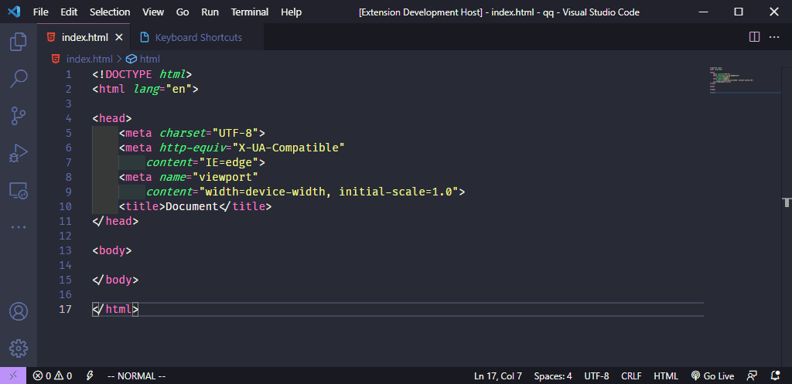

# 功能
將 html 轉換為 string
```
"commands": [{
        "command": "htmltostring.toString",
        "title": "Convert Html To String"
    },
    {
        "command": "htmltostring.toHtml",
        "title": "Convert String To Html"
    }
]
```
